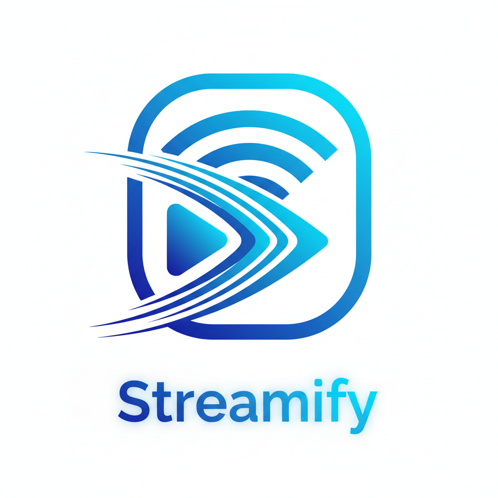

# 📺 Streamify | Full-Stack Video Platform

<p align="center">
    <br>
</p>

**Streamify** is a full-stack video streaming platform built with modern web technologies, offering a comprehensive suite of features for video content creation, management, and consumption. This proprietary application provides a YouTube-like experience with advanced user authentication, video management, social interactions, and analytics capabilities.

> **Note:** This project is **not open source** and is proprietary software. All rights reserved.

---

## 🎯 Project Overview

Streamify is built to handle the full lifecycle of digital video—from secure creator uploads and Cloudinary-powered processing to real-time user engagement and channel analytics.

## 🚀 Core Capabilities
- **Secure Auth**: JWT-based authentication with Refresh Token rotation and Brevo password recovery.
- **Video Lifecycle**: Drag-and-drop uploads, custom thumbnails, and draft/publish workflows.
- **Engagement Engine**: Subscription models, commenting, and like/unlike functionality.
- **Creator Dashboard**: Real-time analytics for views, subscribers, and video-level performance.
- **Advanced Discovery**: Full-text search with MongoDB indexing and chronological watch history.
  
---

## 🏗️ System Architecture

```
Streamify/
├── frontend/     # Vite + React 19 (Hosted on Vercel)
└── backend/      # Node.js + Express + MongoDB (Hosted on Render)

```
---

## 🛠️ Technology Stack

## 🛠️ Technology Stack

| Layer | Technologies |
| :--- | :--- |
| **Frontend** |     |
| **Backend** |     |
| **Media & Services** |    |
| **Deployment** |    |

---

## 🔐 Security Features

- **State-of-the-Art Auth**: HttpOnly cookies and salt-round Bcrypt hashing.
- **Database Efficiency**: Complex data retrieval via MongoDB Aggregation Pipelines.
- **Optimized Delivery**: Lazy loading, code splitting, and Cloudinary CDN transformations.

---

## 📝 License

This project is **proprietary software** and is not open source. All rights reserved. Unauthorized copying, modification, distribution, or use of this software is strictly prohibited.

---

## 👨‍💻 Author

**VasuBhakt** Built with the MERN stack and a focus on scalable system design.

---

**Built with ❤️ using modern web technologies**
